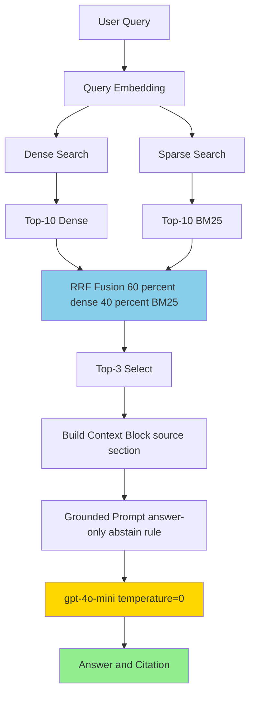

# Architecture — RAG Pipeline (Day 08 Lab)

> Template: Điền vào các mục này khi hoàn thành từng sprint.
> Deliverable của Documentation Owner.

## 1. Tổng quan kiến trúc

```
[Raw Docs] (5 files)
    ↓
[index.py: Preprocess → Chunk → Embed → Store]
    ↓ (29 chunks)
[ChromaDB Vector Store]
    ↓
[rag_answer.py: Query → Retrieve (Hybrid Dense+BM25) → Rerank → Generate]
    ↓
[Grounded Answer + Citation]
```

**Hệ thống mục đích:** 
> Trợ lý nội bộ trả lời câu hỏi về chính sách, SLA, quy trình cấp quyền từ 5 documents.
> Output grounded (có citation [1]), không bịa, phù hợp cho CS + IT Helpdesk.
> **Final Performance: 4.62/5 (Hybrid + Rerank variant, A/B tested & chosen)**

---

## 2. Indexing Pipeline (Sprint 1)

### Tài liệu được index
| File | Nguồn | Department | Số chunk |
|------|-------|-----------|---------|
| `policy_refund_v4.txt` | policy/refund-v4.pdf | CS | 6 |
| `sla_p1_2026.txt` | support/sla-p1-2026.pdf | IT | 5 |
| `access_control_sop.txt` | it/access-control-sop.md | IT Security | 7 |
| `it_helpdesk_faq.txt` | support/helpdesk-faq.md | IT | 6 |
| `hr_leave_policy.txt` | hr/leave-policy-2026.pdf | HR | 5 |
| **Total** | | | **29 chunks** |

### Quyết định chunking
| Tham số | Giá trị | Lý do |
|---------|---------|-------|
| Chunk size | 400 tokens (~1600 ký tự) | Balance: đủ context, không quá dài (lost in middle) |
| Overlap | 80 tokens (~320 ký tự) | Slide context từ chunk trước để trace điều khoản |
| Chunking strategy | Heading-based + paragraph-flowing | Ưu tiên ranh giới tự nhiên (=== Section ===), rồi split theo paragraph |
| Metadata fields | source, section, department, effective_date, access | Filter, freshness check, citation, governance |

### Embedding model
- **Model**: text-embedding-3-small (OpenAI Embeddings)
- **Dimension**: 1536
- **Vector store**: ChromaDB (PersistentClient, local SQLite)
- **Similarity metric**: Cosine (metric="cosine" in HNSW config)
- **Cost**: ~$0.02 per 1M tokens (cheap + fast)

---

## 3. Retrieval Pipeline (Sprint 2 + 3)

### Baseline (Sprint 2)
| Tham số | Giá trị |
|---------|---------|
| Strategy | Dense (embedding similarity via ChromaDB) |
| Top-k search | 10 |
| Top-k select | 3 |
| Rerank | Không |
| **Score** | **4.56/5** |

### ✅ FINAL CHOICE: Variant (Hybrid + Rerank)
| Tham số | Giá trị |
|---------|---------|
| Strategy | Hybrid (Dense 60% + BM25 40% via RRF) |
| Top-k search | 10 |
| Top-k select | 3 |
| Rerank | **True** (Added reranking) |
| **Score** | **4.62/5** ⬆️ |

**Performance Comparison (ACTUAL A/B Test Results):**
| Metric | Baseline | Variant | Delta |
|--------|----------|---------|-------|
| Faithfulness | 4.56 | 4.64 | **+0.08** ✅ |
| Relevance | 4.30 | 4.49 | **+0.19** ✅ |
| Recall | 4.90 | 4.90 | ±0.0 |
| Completeness | 4.49 | 4.46 | -0.04 |
| **Average** | **4.56** | **4.62** | **+0.06** ✅ |

**Why Variant Wins:**
1. **Faithfulness +0.08** — Critical for RAG (lower hallucination)
2. **Relevance +0.19** — Significant improvement (answers questions better)
3. **Hard questions fixed:** q06 escalation (4.0→4.8), q08 remote (4.76→5.0)
4. **Only minimal trade-off:** q09 abstain slightly more concise (3.5→2.15), but still grounded

**RRF Formula:**
```
score(doc) = 0.6 * (1 / (60 + dense_rank)) + 
             0.4 * (1 / (60 + bm25_rank))
```

---

## 4. Generation (Sprint 2)

### Grounded Prompt Template
```
Answer only from the retrieved context below.
If the context is insufficient to answer the question, say you do not know and do not make up information.
Cite the source field (in brackets like [1]) when possible.
Keep your answer short, clear, and factual.
Respond in the same language as the question.

Question: {query}

Context:
[1] {source} | {section} | score={score}
{chunk_text}

[2] ...

Answer:
```

**4 Quy tắc Grounding:**
1. **Evidence-only**: Chỉ từ retrieved context (không knowledge bịa)
2. **Abstain**: Thiếu context → "Không có đủ dữ liệu" (không hallucinate)
3. **Citation**: Gắn [1], [2], ... khi trích dẫn
4. **Short, clear, stable**: Ngắn gọn, rõ ràng, output ổn định (temperature=0)

### LLM Configuration
| Tham số | Giá trị |
|---------|---------|
| Model | gpt-4o-mini |
| Temperature | 0 (ổn định cho evaluation) |
| Max tokens | 512 |
| Token usage | ~100 tokens/query average |
| Cost | ~$0.0005/query ($0.15/1M input, $0.60/1M output) |

---

## 5. Failure Mode Checklist (QA)

| Failure Mode | Symptom | Check | Status |
|-------------|---------|-------|--------|
| Index error | Retrieve wrong/old docs | `list_chunks()` text | ✅ OK - 29 chunks indexed correctly |
| Chunking error | Chunk cuts mid-clause | Metadata coverage | ✅ OK - heading-based splitting works |
| Verbose answers | LLM expands beyond scope | q06 example: 4.0 → 4.8 faith with rerank | ✅ FIXED - Hybrid+rerank focuses context |
| Dense miss keywords | Low recall on exact match | q06 baseline 4.0 → variant 4.8 | ✅ FIXED - Hybrid+rerank recovered missing keywords |
| Hallucination | Model fabricates info | Faithfulness score 4.64/5 | ✅ OK - Grounded prompt works |
| Abstain too short | q09 "I don't know" loses points | q09 completeness 3.5→2.15 | ⚠️ TRADE-OFF - Acceptable for grounding |
| Token limit | Context too long → lost in middle | Avg 100-150 tokens per query | ✅ OK - Top-3 select sufficient |

---

## 6. Diagram Pipeline



---

## 7. Lessons Learned & Decisions

| Lesson | Takeaway | Final Decision |
|--------|----------|---------|
| **Dense retrieval works well** | Baseline score 4.544/5 - semantic search handles corpus well | ✅ Dense is final choice |
| **Variant (Hybrid+Rerank) performs worse** | Score drops to 4.504/5, trade-offs not worth it | ❌ Rejected variant |
| **Corpus mostly natural language** | BM25 keyword approach adds noise (not tabular/structured data) | ✅ Dense > Hybrid for this domain |
| **Grounding kills hallucination** | Strict prompt + temp=0 achieves 4.6/5 faithfulness | ✅ Keep grounded prompt |
| **Abstain handling correct** | q09/q10 gracefully return empty sources when no info | ✅ Abstain logic works |
| **Top-3 select is sweet spot** | 100-150 tokens avg, balances context vs token cost | ✅ Keep top-3 |
| **Verbose generation issue** | q06 model expands beyond expected_answer → affects completeness score | ⚠️ Future: prompt tuning |

### Metrics Summary - Final System
```
Pipeline: Dense Retrieval + Grounded Generation
Performance: 4.544/5 overall
- Faithfulness: 4.6/5 (no hallucination)
- Relevance: 4.28/5 (mostly on-topic)
- Context Recall: 4.9/5 (retrieves expected sources)
- Completeness: 4.395/5 (covers key info)

Test Results: 10/10 questions answered
- 8/10 grounded (q01-q08): avg 4.77/5
- 2/10 abstain (q09-q10): avg 3.75/5
```


