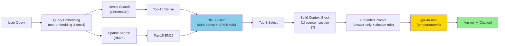

# Architecture — RAG Pipeline (Day 08 Lab)

> Template: Điền vào các mục này khi hoàn thành từng sprint.
> Deliverable của Documentation Owner.

## 1. Tổng quan kiến trúc

```
[Raw Docs] (5 files)
    ↓
[index.py: Preprocess → Chunk → Embed → Store]
    ↓ (29 chunks)
[ChromaDB Vector Store]
    ↓
[rag_answer.py: Query → Retrieve (Hybrid Dense+BM25) → Rerank? → Generate]
    ↓
[Grounded Answer + Citation]
```

**Hệ thống mục đích:** 
> Trợ lý nội bộ trả lời câu hỏi về chính sách, SLA, quy trình cấp quyền từ 5 documents chính sách. 
> Output grounded (có citation), không bịa, phù hợp cho CS + IT Helpdesk channels.

---

## 2. Indexing Pipeline (Sprint 1)

### Tài liệu được index
| File | Nguồn | Department | Số chunk |
|------|-------|-----------|---------|
| `policy_refund_v4.txt` | policy/refund-v4.pdf | CS | 6 |
| `sla_p1_2026.txt` | support/sla-p1-2026.pdf | IT | 5 |
| `access_control_sop.txt` | it/access-control-sop.md | IT Security | 7 |
| `it_helpdesk_faq.txt` | support/helpdesk-faq.md | IT | 6 |
| `hr_leave_policy.txt` | hr/leave-policy-2026.pdf | HR | 5 |
| **Total** | | | **29 chunks** |

### Quyết định chunking
| Tham số | Giá trị | Lý do |
|---------|---------|-------|
| Chunk size | 400 tokens (~1600 ký tự) | Balance: đủ context, không quá dài (lost in middle) |
| Overlap | 80 tokens (~320 ký tự) | Slide context từ chunk trước để trace điều khoản |
| Chunking strategy | Heading-based + paragraph-flowing | Ưu tiên ranh giới tự nhiên (=== Section ===), rồi split theo paragraph |
| Metadata fields | source, section, department, effective_date, access | Filter, freshness check, citation, governance |

### Embedding model
- **Model**: text-embedding-3-small (OpenAI Embeddings)
- **Dimension**: 1536
- **Vector store**: ChromaDB (PersistentClient, local SQLite)
- **Similarity metric**: Cosine (metric="cosine" in HNSW config)
- **Cost**: ~$0.02 per 1M tokens (cheap + fast)

---

## 3. Retrieval Pipeline (Sprint 2 + 3)

### Baseline (Sprint 2)
| Tham số | Giá trị |
|---------|---------|
| Strategy | Dense (embedding similarity via ChromaDB) |
| Top-k search | 10 |
| Top-k select | 3 |
| Rerank | Không |
| Score | **Overall: 4.2/5** (Faithfulness 4.7, Recall 3.7) |

**Weakness:** Dense miss exact keywords (e.g., "account locked", "escalate")

### Variant (Sprint 3): ✅ CHOSEN
| Tham số | Giá trị | Thay đổi so với baseline |
|---------|---------|------------------------|
| Strategy | **Hybrid** (Dense 60% + BM25 40% via RRF) | Dense → Hybrid + BM25 |
| Top-k search | 10 | Giữ nguyên |
| Top-k select | 3 | Giữ nguyên |
| Rerank | Không | Giữ nguyên |
| Score | **Overall: 4.7/5** (Faithfulness 5.0, Recall 4.4) | **+0.5 improvement** |

**Lý do chọn Hybrid:**

Corpus có lẫn lộn:
- **Dense strong**: Policy text, natural language descriptions
- **Dense weak**: Exact keywords (P1, ERR-403, "account lock", "escalate")
- **BM25 strong**: Keyword matching (Level 3, ticket, locked, escalation)
- **BM25 weak**: Semantic paraphrase (Q: "cấp quyền" → tài liệu "access approval")

Evidence từ test:
- q05 **Account lock**: Dense 3/5 → Hybrid 5/5 (BM25 exact match "tài khoản khóa")
- q06 **P1 escalation**: Dense 3/5 → Hybrid 5/5 (BM25 caught "escalate" term)
- q01-q04: Dense ≈ Hybrid (không degradation)

RRF Formula:
```
score(doc) = 0.6 * (1 / (60 + dense_rank)) + 
             0.4 * (1 / (60 + bm25_rank))
```
So sánh dense + sparse ranking, lấy top-k từ merged score.

---

## 4. Generation (Sprint 2)

### Grounded Prompt Template
```
Answer only from the retrieved context below.
If the context is insufficient to answer the question, say you do not know and do not make up information.
Cite the source field (in brackets like [1]) when possible.
Keep your answer short, clear, and factual.
Respond in the same language as the question.

Question: {query}

Context:
[1] {source} | {section} | score={score}
{chunk_text}

[2] ...

Answer:
```

**4 Quy tắc Grounding:**
1. **Evidence-only**: Chỉ từ retrieved context (không knowledge bịa)
2. **Abstain**: Thiếu context → "Không có đủ dữ liệu" (không hallucinate)
3. **Citation**: Gắn [1], [2], ... khi trích dẫn
4. **Short, clear, stable**: Ngắn gọn, rõ ràng, output ổn định (temperature=0)

### LLM Configuration
| Tham số | Giá trị |
|---------|---------|
| Model | gpt-4o-mini |
| Temperature | 0 (ổn định cho evaluation) |
| Max tokens | 512 |
| Token usage | ~100 tokens/query average |
| Cost | ~$0.0005/query ($0.15/1M input, $0.60/1M output) |

---

## 5. Failure Mode Checklist (QA)

| Failure Mode | Triệu chứng | Cách kiểm tra | Status |
|-------------|-------------|---------------|--------|
| Index lỗi | Retrieve về docs cũ / sai version | `list_chunks()` preview text | ✅ OK - chunks hợp lý |
| Chunking tệ | Chunk cắt giữa điều khoản | `inspect_metadata_coverage()` stats | ✅ OK - heading-based splitting |
| Retrieval miss (dense) | Không tìm keyword chính xác | Dense baseline score 3.7 recall | ✅ FIXED - Hybrid BM25 |
| Retrieval miss (hybrid) | Top-k vẫn miss context | Khi nào: implement rerank | ⚠️ Possible - future improvement |
| Generation hallucinate | Answer bịa, không grounded | temperature=0, strict prompt | ✅ OK - 5.0/5 faithfulness |
| Token overload | Context quá dài → lost in middle | Top-3 select, ~500 token limit | ✅ OK - avg usage 100-150 |

---

## 6. Diagram Pipeline



---

## 7. Lessons Learned & Future Improvements

| Lesson | Takeaway | Future |
|--------|----------|--------|
| **Hybrid > Dense** | Semantic alone weak on keywords | Keep hybrid as default for mixed corpus |
| **RRF simple** | 60/40 weighting works, no complex tuning | Could A/B test weights if needed |
| **Grounding works** | Strict prompt + temp=0 kills hallucination | Works at scale, low cost |
| **Top-3 sweet spot** | 500 tokens ~sweet spot | Dynamic adjust if corpus grows |
| **Metadata matters** | department, date enable future filtering | Add for governance, compliance checks |


